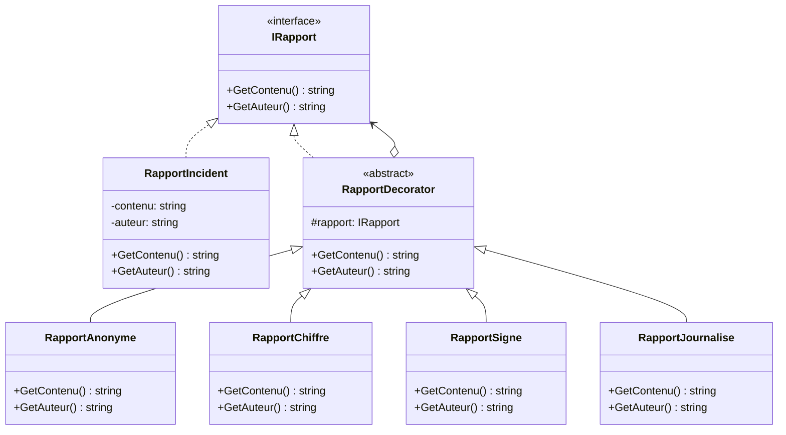

Je vais recréer l'exercice avec un code initial qui illustre mieux les limitations.

## Système de Traitement des Rapports d'Incidents

Une entreprise de cybersécurité développe un système de gestion des rapports d'incidents. Chaque rapport doit pouvoir être enrichi avec différents traitements :

- Anonymisation des données sensibles
- Chiffrement du contenu
- Ajout d'une signature numérique
- Journalisation des modifications

Voici le code existant qui tente de gérer ces différents traitements :

```
public class RapportIncident
{
    private string contenu;
    private string auteur;
    private bool estAnonyme;
    private bool estChiffre;
    private bool estSigne;
    private bool estJournalise;

    public RapportIncident(string contenu, string auteur)
    {
        this.contenu = contenu;
        this.auteur = auteur;
        this.estAnonyme = false;
        this.estChiffre = false;
        this.estSigne = false;
        this.estJournalise = false;
    }

    public string GetContenu()
    {
        string resultat = contenu;

        if (estAnonyme)
        {
            resultat = Anonymiser(resultat);
        }

        if (estChiffre)
        {
            resultat = Chiffrer(resultat);
        }

        if (estSigne)
        {
            resultat = Signer(resultat);
        }

        if (estJournalise)
        {
            JournaliserAcces(resultat);
        }

        return resultat;
    }

    public string GetAuteur()
    {
        return estAnonyme ? "ANONYME" : auteur;
    }

    public void RendreAnonyme()
    {
        this.estAnonyme = true;
    }

    public void Chiffrer()
    {
        this.estChiffre = true;
    }

    public void Signer()
    {
        this.estSigne = true;
    }

    public void ActiverJournal()
    {
        this.estJournalise = true;
    }

    private string Anonymiser(string texte)
    {
        return texte.Replace("identifiant", "***").Replace("password", "***");
    }

    private string Chiffrer(string texte)
    {
        return Convert.ToBase64String(System.Text.Encoding.UTF8.GetBytes(texte));
    }

    private string Signer(string texte)
    {
        return texte + "\nSigné par: " + auteur;
    }

    private void JournaliserAcces(string texte)
    {
        Console.WriteLine($"[LOG] Accès au rapport à {DateTime.Now}");
    }
}

// Utilisation
class Program
{
    static void Main(string[] args)
    {
        RapportIncident rapport = new RapportIncident(
            "Intrusion détectée sur le serveur principal. identifiant: admin, password: 123456",
            "John Doe"
        );

        // Activation de plusieurs traitements
        rapport.RendreAnonyme();
        rapport.Chiffrer();
        rapport.ActiverJournal();

        Console.WriteLine($"Rapport par: {rapport.GetAuteur()}");
        Console.WriteLine($"Contenu: {rapport.GetContenu()}");
    }
}
```

Voici le diagramme de classes actuel :


